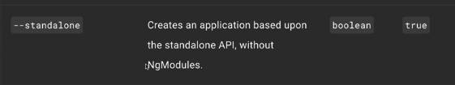
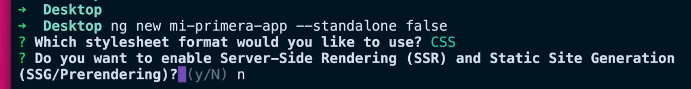

Esta es una nota por la ultima actualizacion de Angular, la v17, lanzada recientemente (a princios de noviembre).

Esta version es retrocompatible con la versiones anteriores de Angular.

"No hay breaing changes, es decir cambios importantes que nos obliguen a realizar modificaciones importantes tambien en el codigo. Si asi fuera, y actualizamos la version de angular en nuestros proyectos, estos podrian dejar de funciones obligandonos a realizar cambios importantes para que sea compatible con la nueva version.

Ya que no hay bracking changes podemos actualizar sin problemas, sin preocuparnos que nuestro codigo deje de funcionar. De esta forma poder aprovecharlas mejoras y correciones de errores agregadas en la ultima version del framework." (By ChatGPT con modificaciones propias para la redaccion).

Ademas de los standalones components agregaron un nuevo control del flujo.

Fernando nos recomienda seguir trabajando con modulos y despues veremos la nueva sintaxis del control de flujo.

Tener en cuenta la nueva documentacion de angular (aun esta en BETA)
https://angular.dev/

La documentacion clasica:
https://angular.io

Aunque la nueva documentacion tiene la misma informacion que la clasica, le agregaron diseños dinamicos a su pagina, nuevo logo con una paleta de colores distinta y obviamente la documentacion sobre esta ultima version 17.

Aunque, Herrera nos dice que, como en esta ultima actualizacion se quiere dejar de usar la organizacion por modulos sino por standalones components, agregaron que al crear un proyecto (ng new <nombreProyecto>) por default se cree todo de esta forma, como standalones components.

(Esto se puede ver en la documentacion oficial, agregando en el buscador de la pagina el comando "ng new")

Luego, para poder seguir trabajando con modulos usando esta ultima version de Angular, debemos agregar el siguiente flag al crear un proyecto:

Osea: ng new <NombreProyecto> --standalone false
De esta forma anulamos que se creen los componentes de los modulos de forma standalone.
Ahora tambien, Angular cuenta con SSR sin necesidad de Angular Universal.. Esto no lo entendi xD Cuestion que le ponemos que NO para seguir trabajando de la forma tradicional. Y ahi terminaria la configuracion.

