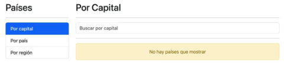
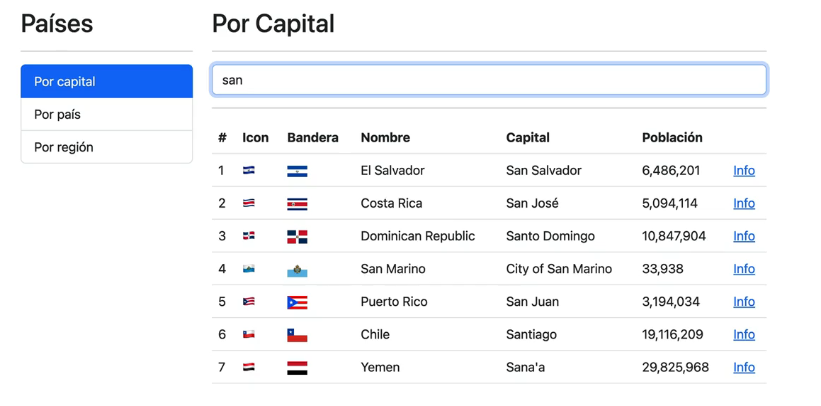
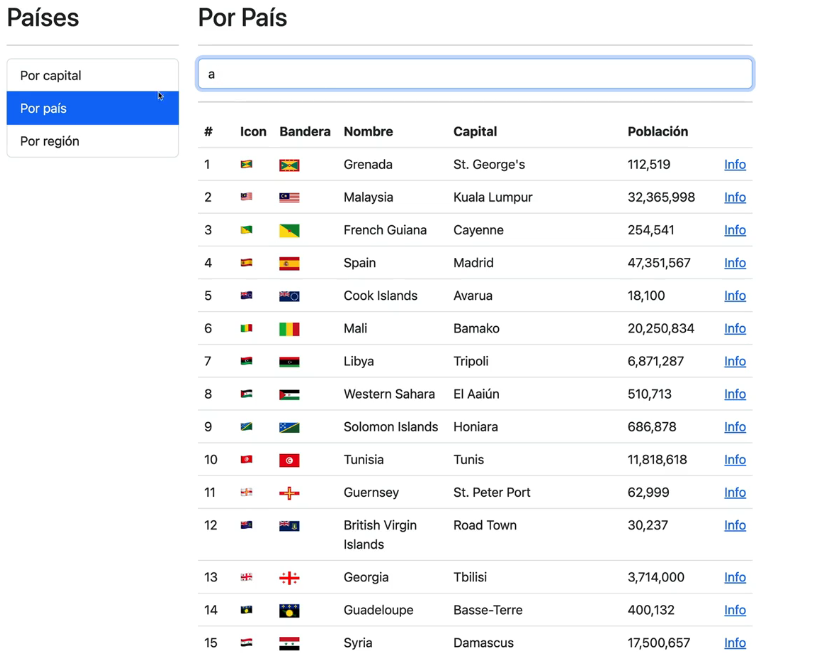
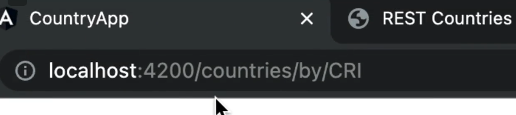
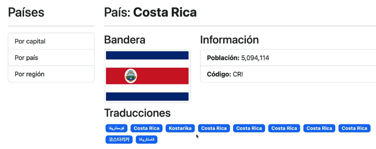

## Este es el objetivo al finalizar la seccion:

Vamos a tener diferentes rutas, y nuestro componente no usa un ngIf para cambiar entre las distintas opciones de la barra lateral. Si no que se esta usando rutas de angular. Aqui exactamente, rutas hijas que son cargadas de forma perezosa.

Esto de la carga perezosa lo hacemos en nuestro modulo principal.
De esta forma, cuando se ingresa a tal modulo, tiene un peso super pequeño en bytes. 
 
Veremos: 

- Rutas principales
- Rutas

Podremos buscar paises por la capital:

Por pais, incluso si solo ponemos una letra, ya podemos obtener resultados:

Prestar atencion a las URLs que estamos manejando:

Pordemos ver mas info de cada pais:

Tambien trabajaremnos con:
- Pipes
- Lazy loading de modulos
- Operadores de RXJS
- Funciones generadores de observables