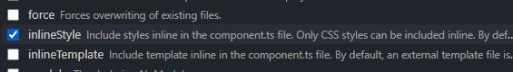
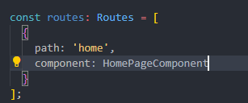
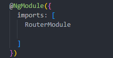

Recordemos que en la carpeta de "shared" en la cual tenemos el modulo 'SharedModule', vamos a tener la misma estructura que venimos trabajando, dentro tendremos otra carpeta 'components' que tendra todos los componentes que vamos a compartir a lo largo de nuestra aplicacion. 

Tales componentes son:
> "piezas que no caen dentro de ningun otro modulo". 

>"componentes que yo puedo usar en cualquier otro modulo, y no estan amarrados a ellos".

Tambien dentro de la carpeta 'shared' vamos a tener la carpeta 'pages'. Tecnicamente no necesitariamos esta carpeta aqui dentro, pero sera parte del objetivo de aprender nuestra navegacion de la parte de los paises de nuetra app, ya tengamos la base. Es una demostracion para no agregarlo dentro de otros modulos.

Dentro de pages tendremos 2 nuevos componentes.

Los vamos a crear con la extension Angular Schematics. Nombrado como 'homePage'. Luego vamos a hacer clic aqui:

Y seleccionaremos las siguientes configuraciones:

El primero, no nos crear el archivo css (va a ser inline) y el segundo lo mismo, pero con el archivo de pruebas.
Luego nos aparece para confirmar, mandar todo TRUE, TRUE, OK.

**Importante: recordar que este componente creado 'HomePageComponent' vamos a utilizarlo en otro modulo, entonces debemos exportarlo.**
Esto lo hacemos agregando el atributo "exports" en el modulo correspondiente: 'SharedModule'.

De la misma forma, con las misma configuraciones, creamos el componente: 'AboutPageComponent', file: 'about-page'.

Con los comandos, podriamos hacer lo mismo de esta forma:

Los dos componentes creados, los usamos aqui:

### Aprenderemos a cambiar de manera dimanica entre los dos componentes a traves del URL.

Es decir, segun el url, queremos ver un componente u otro. Principalmente, queremos ver el homePage, pero si cliqueamos en x lugar, cambiar al componente AboutPage.
 

## Definiendo configuracion de rutas
La forma de configurar esto fue cambiando entre las distintas versiones de Angular. Veremos la forma actual recomendada a partir de 2023.

Creamos el siguiente archivo dentro de nuestra carpeta 'app':

> Notar que es como un modulo comun y corriente.

Dentro del archivo usar el sniped: a-module (tab)
Se genera todo el modulo default. Dejamos solo esto y nombramos el modulo asi:

Creamos la siguiente constante, la cual es la definicion de cada una de las rutas que usaremos:

Dentro agregamos los siguientes atributos:

- 'path': representa lo que va a aparecer en el url de la pagina luego del dominio de tal.
- 'component': el componente que se ejecutará al acceder a dicho path.

Aqui ya tenemos agregados nuestros dos componentes:

Y si el usuario entra a una ruta que no tenga definida, a traves del dominio de mi pagina?
Ahi agregamos lo siguiente, quedando finalmente:

- Entonces cualquier ruta que no sea, ni /home o /about, se redireciconara al home...

### IMPORTANTE:
Aun no estamos usando todo las rutas que definimos anteriormente.
1. Para esto dentro del decorador del modulo empezamos haciendo una importacion:

Importado de:

 
2. Ahora, como este modulo de enrutamiento, es el principal de la aplicacion, usamos '.forRoot' y le pasamos la direccion de nuestra rutas definidas:

> Despues cuando estemos trabajando con las rutas en otros modulos, en esos usariamos un 'forCHild()'.

### Con esto ya tenemos un modulo independiente especializado en la navegacion de mi aplicacion.
Pero.. tiene que estar conectado a nuestro 'app.module' porque si no queda en la nada nuestro archivo de enrutamiento.

Exportando el modulo Router:

Importando el modulo:

### Todo esto que venimos haciendo hasta aqui es la configuracion basica de un router.
Hay mas opciones que se pueden hacer, como protecciones de rutas, etc, luego seguiremos profundizando.

### Toda esta configuracion se hace de manera automatica cuando le decimos que SI nos cree el routing en Angular, al crear el proyecto.

Ahora podemos probar desde el navegador web las diferentes rutas.

Automaticamente vemos lo sig:

- Si escribimos cualquier cosa nos redireccionara al home como lo hemos configurado.

Luego con el siguiente elemento especial del angular router, en el file 'app.component.html': 

Nos va a renderizar el componente en ese lugar, segun la ruta en la que se encuentre. Es decir, segun en la ruta que estemos en el navegador web.
