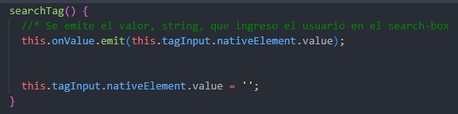

### En esta clase, se practican/repasan los siguientes temas:
- @Input()
- @Output()
- \#Ref
- @ViewChild('Ref') 

- \#NombreReferencia: se usa el numeral junto con un nombre, seria una referencia local, como un selector por id. Tal nombre seria como ponerle un identificador a un elemento HTML.
 
-  @ViewChild('NombreReferencia'): es un decorador para agarrar la referencia de un elemento HTML, y se le pasa por argumento el nombre de la referencia local en string y se declara una variable, que es donde se va a guardar tal referencia.
<pre>
      @ViewChild('NombreReferencia') 
      public taginput!: ElementRef<HTMLInputElement>; 
</pre>

- Decorador @Output() y EventEmitter
<pre>
      @Output()
      public onValue: EventEmitter<string> = new EventEmitter();
</pre>

