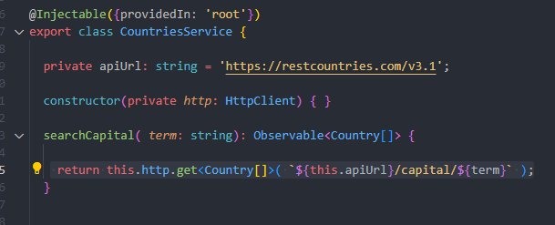

Vamos a trabajar con esta API: https://restcountries.com/

- En Postman hacemos la siguiente peticion http get: https://restcountries.com/v3.1/capital/san 
 
- Que significa que buscamos una capital que tenga 'san' en alguna parte de su nombre como capital.. :v
 
- Copiamos toda la response, y vamos a mappear la interface para nuestros objetos.. De esta forma estamos tipando la response de la API.
   
  PD: Si no nuestra app no sabria con que tipos de dato esta trabajando (any). Luego lo trabajaremos con clases, por ahora con interfaces, ya que sabemos que las interfaces no obligan a que el objeto tenga esa estructura, nos tira un error el IDE si ponemos un atributo extra, si, pero igualmente no tira un error en ejecucion.. Osea que toma la estructura.
  

  - ### lo mapeamos con la extension 'paste JSON as code' (con ctrl + shift + p y >Paste JSON..., enter, se agrega el nombre de la interface, enter y listo) 
  - Otra forma es con la pagina, creadores de la extension, https://quicktype.io/, se pega toda la response al costado izq, se selecciona el lenguaje TS ;v 

- Creamos el servicio 'CountriesService a traves del sniped a-service-httpclient, que ya nos importa e inyecta de entrada el servicio HttpClient desde '@angular/common/http', tambien debemos importar el 'HttpClientModule' en el modulo que lo vamos a utilizar. Como lo vamos a usar en toda la app, lo importamos en el modulo principal 'app.module.ts'.

- Si la importacion no nos aparece de forma automatica, para importa el modulo, escribimos la sig linea:
> import { HttpClientModule } from '@angular/common/http';

- Aqui en la peticion  .get: se debe especificar el tipo de dato que va a retornar, es un generico. 

- Y aca en Angular, NO retorna una promesa, como en JS, sino que retorna un Observable.

- Siempre especificar el tipo que va a retornar, porque sino Ts igualmente va a inferir, dira q es un Object, pero esto no nos sirve mucho, porque no sabesmo que atributos y metodos tiene eso. Entonces para saber con que estamos trabajando, siempre definir los tipos, lo mismo con el metodo, si no retorna nada -> :void.

- IMPORTANTE: si no nos subscribimos al observable, entonces no esta terminada la peticion, en realidad no se esta haciendo ninguna peticion... Esta configurada la solicitud, esta definida, asi como se ve en la imagen, linea que tiene el foquito :v , pero no se ejecuta. Tenemos que subscribirnos para escuchar ese cambio/valor que emitira el Observable.
