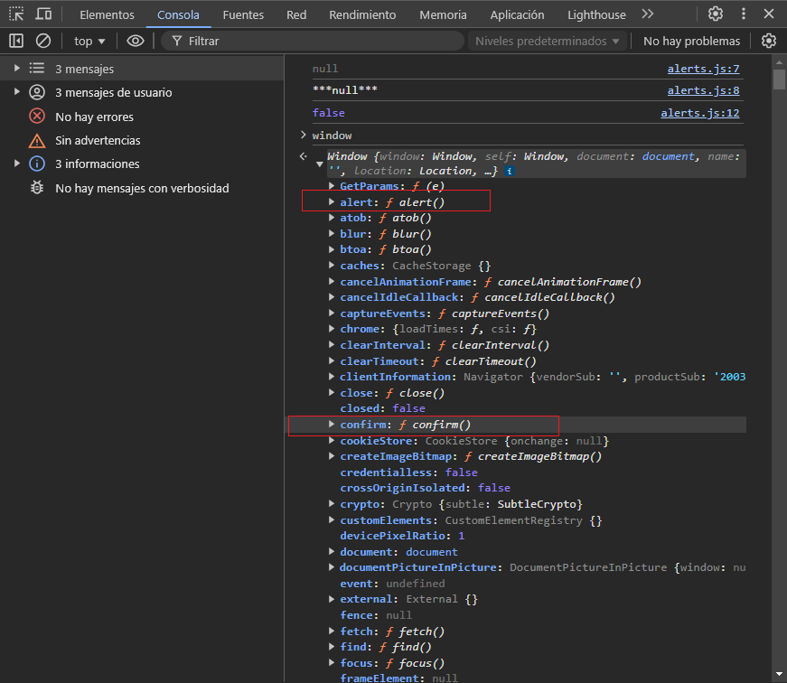
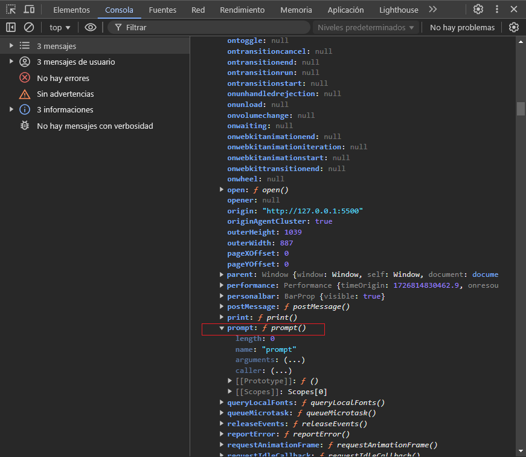
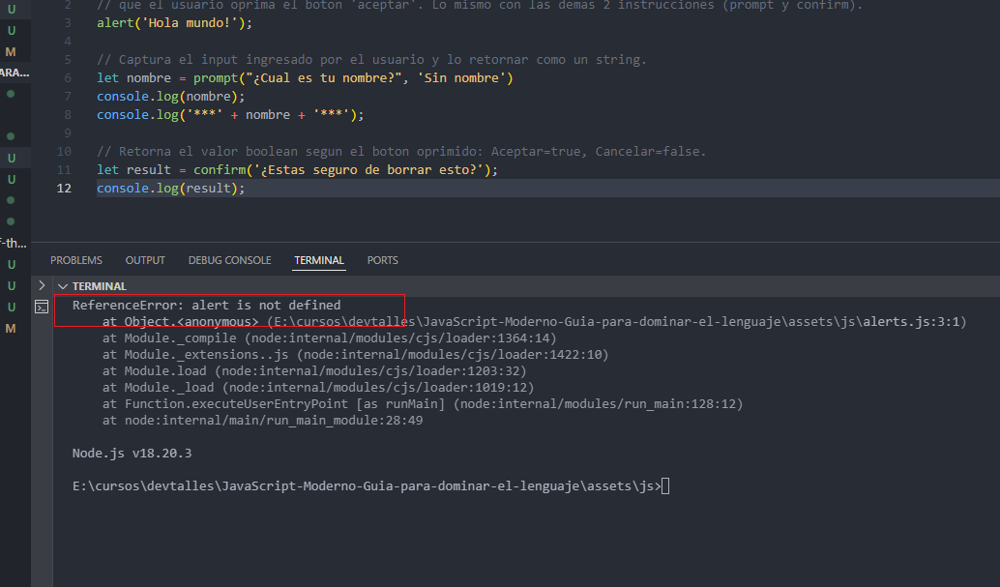

Estas tres funciones: prompt, confirm y alert son BLOQUEANTES. Es decir que detienen el flujo de ejecucion del programa.

Tambien otro dato importante, es que tales funciones son metodos del objeto WINDOW. Al escribir 'window' y tocar enter en la consola del navegador lo podemos ver.

Entonces, si nosotros ejecutamos un codigo usando alguna de los metodos anteriores en otro lugar que no sea el navegador web o que no tenga la instancia de window, tal codigo no va a funcionar.
Para demotrar esto vamos a ejecutar el codigo con node:

Aunque en node existe algo parecido al objeto window, llamado "global", que tiene algunas funciones parecidas: