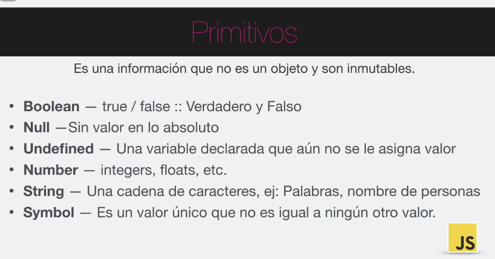
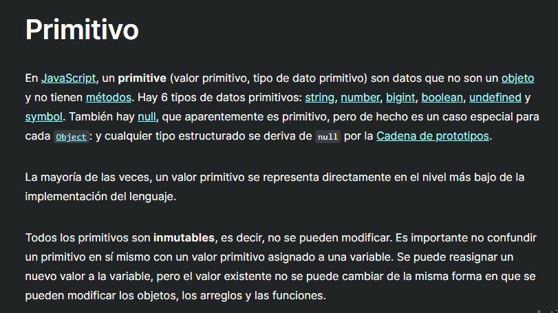

Sabemos que JS es un lenguaje debilmente tipado. Eso significa que nosotros no le decimos explicitamente a JS que tipo de dato vamos a usar sino mas bien que el mismo JS va a inferir por nosotros.

Pero.. ¿Que es el tipo de dato de una variable? Describe el contenido del valor que tiene la variable.

¿Que son los primitivos? Es una informacion que NO es un objeto y son INMUTABLES.

Revisando otras fuente como: https://developer.mozilla.org/es/docs/Glossary/Primitive

