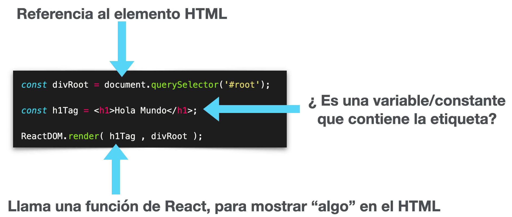

## ¿Que es React?

- **Libreria**: React es una libreria que nos permite crear aplicaciones. Al ser una libreria nosotros podemos pegarla en el HTML de nuestra pagina y usarla inmediatamente. No es la forma tradicional de hacerlo pero es posible.

React esta hecha para trabajar con aplicaciones de todo tipo de magnitud, ya sean aplicaciones sencillas, aplicaciones intermedias o aplicaciones robutas con alto nivel de interatvidad.

- **Declarativa**: al ser declarativa hace facil seguir patrones de diseño y crear interfaces de usuario interactivas.

- **Eficiente**: cuando hacemos un cambio que tiene que ser renderizado, React hace el cambio solamente en ese elemento.

- **Predecible**: toda la informacion fluye en una sola via (tema que veremos mas adelante). Esto nos permite a prevenir mutaciones involuntarias o impredecibles.

-**Componentes**: son pequeñas piezas de codigo encapsuladas que pueden tener estado o no, y de esta forma podemos romper una aplicacion que sea bastante compleja en pequeños componentes, pequeñas piezas sencillas faciles de mantener-

-**Server-side con Node**: se puede trabajar del lado del servidor, aplicaciones de react con Node.

-**Aplicaciones moviles con React Native**: tambien podemos desarrollar aplicaciones moviles con React Native.

Y tanmbien podemos desarrollar aplicaciones de escritorio utilizando electron y otras tecnologias, todo con el mismo tipo de código.

Un ejemplo de como luce un codigo de React:

Notar que la primera linea que tenemos es Js puro. Estamos haciendo referencia a este div con id 'root':

Luego tenemos un objeto llamado ReactDOM que tiene un metodo render, que como primer parametro acepta codigo HTML y como segundo parametro la referencia de donde queremos renderizar o mostrar en pantalla ese elemento que le pasamos, el h1 con el hola mundo.

Separando el HTML en una cte:

Tal mexcla entre js y html es conocida como JSX:
