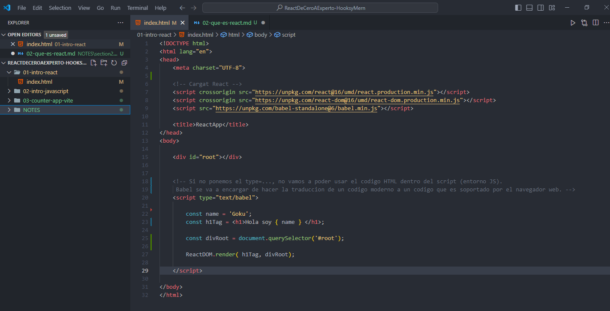

### Hicimos el siguiente ejemplo de una pequeña aplicacion en React: 


Para tal aplicacion copiamos y pegamos en el  head del HTML las siguientes referencias para importar React y Babel:

```HTML
    <!-- Cargat React -->
    <script crossorigin src="https://unpkg.com/react@16/umd/react.production.min.js"></script>
    <script crossorigin src="https://unpkg.com/react-dom@16/umd/react-dom.production.min.js"></script>
    <script src="https://unpkg.com/babel-standalone@6/babel.min.js"></script>   
```

- La primera es la libreria propia de React.
- La segunda es React DOM que se va a encargar en la parte del navegador web.
- Es la referencia a Babel.

NOTA: Si no ponemos el type="text/babel", no vamos a poder usar el codigo HTML dentro del script (entorno JS). 
Babel se va a encargar de hacer la traduccion de un codigo moderno a un codigo que sea soportado por el navegador web.

Si nos fijamos en la consola del navegador web cuando la aplicacion esta levantada, vamos a tener un warning que es porque estamos usando la transformacion de babel directamente. Esto no nos va a suceder cuando ya estemos trabajando propiamente en react, ya que la liberia React usa Babel en el background, nosotros no vamos a configurarlo.
