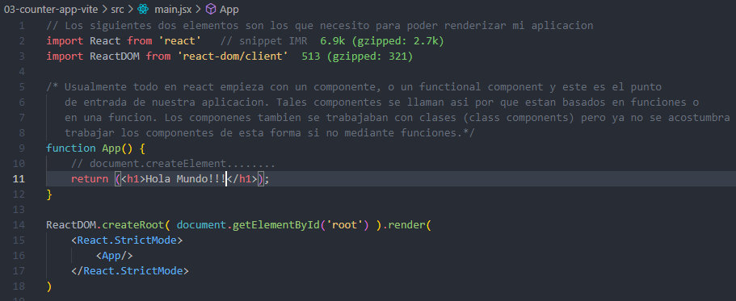

## Creamos el primer proyecto:

1. Herrera creo el proyecto usando el comando:
    > yarn create vite

2. Luego sale un menu, le ponemos nombre al proyecto y seleccionamos REACT y JS (Vanilla).

3. Despues entramos a la carpeta del proyecto creado: 
    > cd nombre-proyect

4. Instalamos los paquetes de node ("npm install" con npm) con yarn:
    > "yarn install" o simplemente "yarn'.
    
5. Despues levantamos el proyecto. En npm seria:  "npm run dev", pero como estamos usando yarn como gestor de paquetes y dependencias usamos: 
    > yarn dev
    
    Si estuvieramos usando npm usariamos: npm run dev.

PD: De esta forma creamos el proyecto llamado "03-counter-app-vite".

