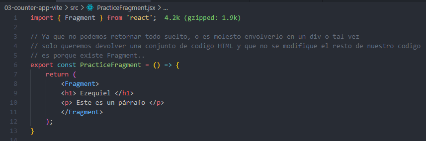
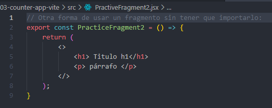

## ¿Que es Fragment?

Es un agrupador de otros elementos HTML o en nuestro caso otros elementos JSX.
Ya que es una regla de React que siempre tiene que haber un nodo padre y dentro de esto pueden ir todos los elementos que querramos.. Pero todo suelto  no. Es necesario que se retorne un nodo padre que contenga la referencia para todo el conjunto.

Otra forma mas utilizada de hacer lo mismo:

