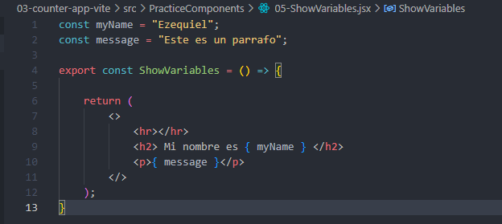
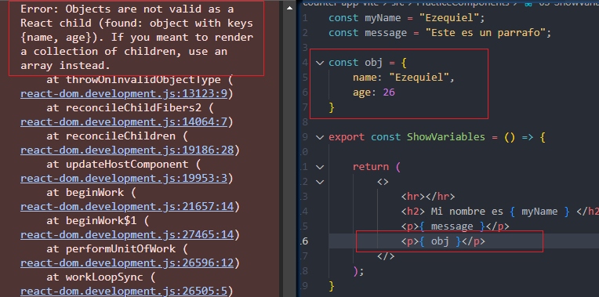
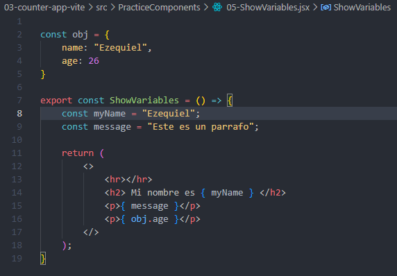

## Mostrando variables dentro del codigo HTML

Lo podemos hacer usando las llaves { }.

Dentro de las llaves podemos poner todo lo que sea codigo JS, menos objetos...

Podriamos meter las variables dentro de la funcion:

Aunque no hace falta. Ya que si no van a estar cambiando sus valores y ademas no tienen ninguna relacion con algun HOOK no es recomendado que estar alli adentro de la funcion. Un beneficio de dejarlo afuera es que React no va a renderizarlo o re-renderizar nuevamente aquello que no pertezcan a un componente, si es que hiciese falta re-renderizarlo.

Si queremos mostrar el objeto de todas formas, podemos hacerlo asi:
