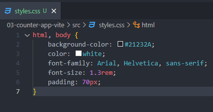
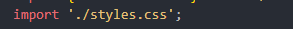

#### Agregamos estos estilos:

Obviamente hay que importarlo en nuestro main.jsx si queremos aplicar tales estilos, sino seria un archivo css flotando en el universo de nuestro proyecto.. 

De esta forma agregamos estilos GLOBALES a todos los componenes de nuestra aplicación.