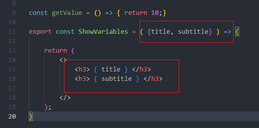

## Comunicacion entre componentes - Props

Properties que los functional components reciben, mas conocidas como props. 

Alli desde el componente padre le mandamos dos propiedades.
Y en el componente hijo las podemos utilizar:

