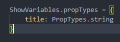
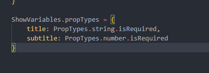
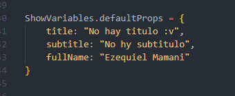

## Proptypes

Una forma de obligar a que se manden los propiedades definidas en un componente, a si como el tipo de dato. 
Para implementar las proptypes si creamos el proyecto con VITE debemos instalarlas manualmente.
Si lo creamos con CRA (Create React App) al proyecto no hace falta por que ya viene instalado.

- Como yo lo hice con VITE (y con yarn) usamos el siguiente comando para:
    > yarn add prop-types

Si fuera con npm usariamos: npm install prop-types

- Y tambien agregamos la siguiente importacion en el archivo de nuestro componente:
    > import PropTypes from 'prop-types'

- Por ultimo debemos definir los proptypes en nuestro componente:

- Y de tal forma exigimos que el tipo de dato que se envie sea un string. No asi que sea enviado... Js al ser un lenguaje flexible no tira error si no se le manda ninguna property.
Si queremos que si o si se envie un valor le agregamos "isRequired", quedando asi:
    >  title: PropTypes.string.isRequired!

## Proptypes

Una forma de obligar a que se manden los propiedades definidas en un componente, a si como el tipo de dato. 
Para implementar las proptypes si creamos el proyecto con VITE debemos instalarlas manualmente.
Si lo creamos con CRA (Create React App) al proyecto no hace falta por que ya viene instalado.

- Como yo lo hice con VITE (y con yarn) usamos el siguiente comando para:
    > yarn add prop-types

Si fuera con npm usariamos: npm install prop-types

- Y tambien agregamos la siguiente importacion en el archivo de nuestro componente:
    > import PropTypes from 'prop-types'

- Por ultimo debemos definir los proptypes en nuestro componente:

- Y de tal forma exigimos que el tipo de dato que se envie sea un string. No asi que sea enviado... Js al ser un lenguaje flexible no tira error si no se le manda ninguna property.
Si queremos que si o si se envie un valor le agregamos "isRequired", quedando asi:
    >  title: PropTypes.string.isRequired

Si queremos tipar tambien la otra propiedad:

## Default Props

De esta fomrma lso definimos. Estos nos sirven para tener ordenados los valores por defecto de los props. Por ejemplo cuando no llega ningun valor desde el componente padre se mandan dichos default props:

