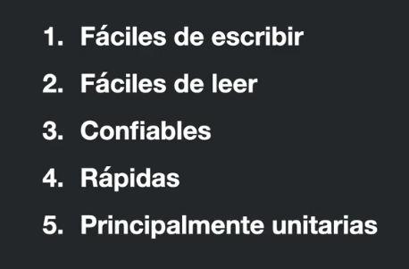
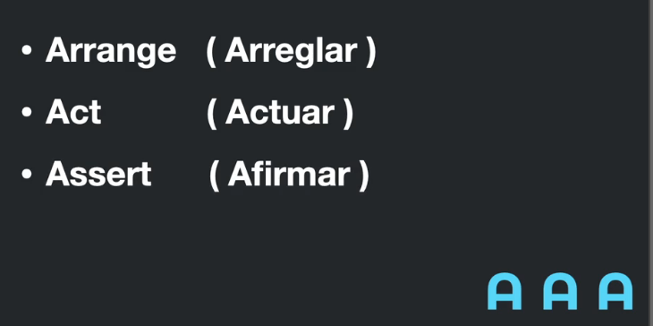

# Introduccion a las pruebas unitarias y de integración

- ¿Que son las pruebas? 
- ¿Para que sirven?
- Caracteristicas
- Mitos
- Lineamientos

### ¿Que son las pruebas? 
1. Primero que nada, NO SON UNA PERDIDA DE TIEMPO. 
2. Hay dos tipos principales de pruebas: unitarias y de integracion.
    - **Pruebas unitarias**: estan enfocadas en pequeñas funcionalidades de la aplicación, en pequeñas piezas que hay que probar.
    - **Pruebas de integración**: estan enfocadas a como funcionan varias piezas en conjunto.

Caracteristicas de las pruebas: 

AAA:

**Arrange - Arreglar**: es el paso donde establecemos el estado inicial. Usualmente se conoce como "el sujeto" a probar. 
    - Inicializamos variables.
    - Importaciones necesarias.
    - En general preparamos el ambiente a probar.

**Act - Actuar**: es donde nosotros vamos a aplicar acciones o estimulos al sujeto de pruebas.
    - Llamar metodos.
    - Simular clicks.
    - Realizaciones acciones sobre el paso anterior.

**Assert - Afirmar**: aqui observamos el comportamiento resultante.
    - Si lo resultados son los esperados.
    - Ej: que algo cambie, algo incremente o bien que nada suceda.

### Mitos

