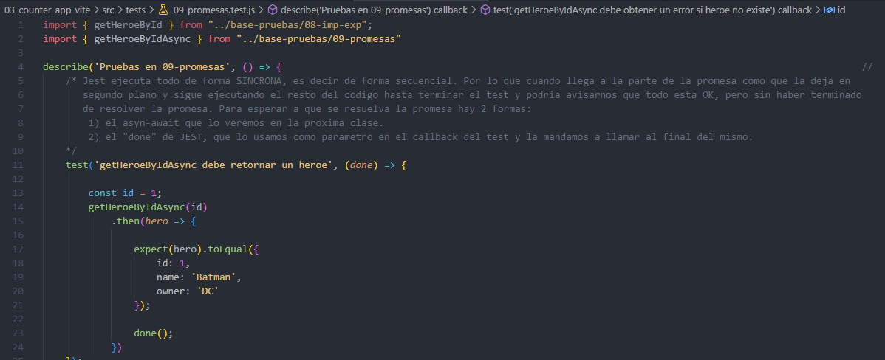

Jest ejecuta todo de forma SINCRONA, es decir de forma secuencial. Por lo que cuando llega a la parte de la promesa como que la deja en segundo plano y sigue ejecutando el resto del codigo hasta terminar el test y podria avisarnos que todo esta OK, pero sin haber terminado de resolver la promesa. 

Para esperar a que se resuelva la promesa hay 2 formas: 
1) el asyn-await que lo veremos en la proxima clase.
2) el "done" de JEST, que lo usamos como parametro en el callback del test y la mandamos a llamar al final del mismo.

